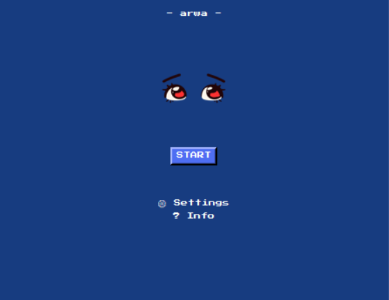
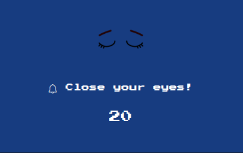
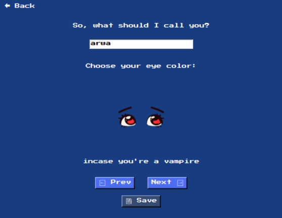
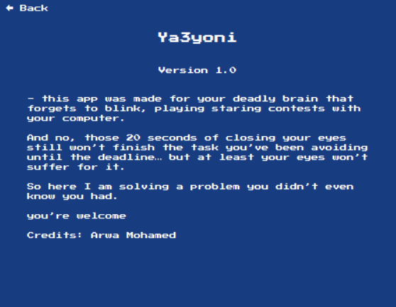

# Ya3yoni - Eye Care Desktop App

A fun and practical desktop application designed to remind users to take eye breaks, reduce eye strain, and follow simple eye care routines while working on the computer.

---

## Features

- Reminds users to close their eyes for 20 seconds at set intervals.
- Customizable eye color with fun themes.
- Personalize your username in the app.
- Playful sounds and animations to make eye care enjoyable.
- Lightweight and easy to run on any computer.

---

## Requirements

- Python 3.10+
- Tkinter
- Pillow
- pygame

---

## Installation

1- Clone the repository:
    ```bash
    git clone https://github.com/arwa-28/YA3YONI.git

2-Navigate to the project folder:
    cd ya3yoni

3- Install dependencies:
    pip install -r requirements.txt

4- Run the app:
    python main.py

---

## Usage

1- Open the app by running main.py.

2- Click START to begin eye care reminders.

3- Access Settings to choose your preferred eye color and set your username.

4- Follow the 20-second eye break popups that appear at intervals.

5- Click STOP to pause reminders.

---

## Screenshots
### Main Screen

The main interface of "Ya3yoni" showing your username and the current eye icon. Users can start or stop the eye care reminders and navigate to settings or info.



### Popup

Popup reminders that appear periodically, prompting users to close their eyes for 20 seconds. Includes a countdown and a sound alert when the timer ends.



### Settings

Settings page where users can change their username and select their eye color. Includes navigation buttons for previous/next eye icons and a save button to store changes.



### Info

Information page about the app, its purpose, version, and credits. Background music plays while viewing this page.


